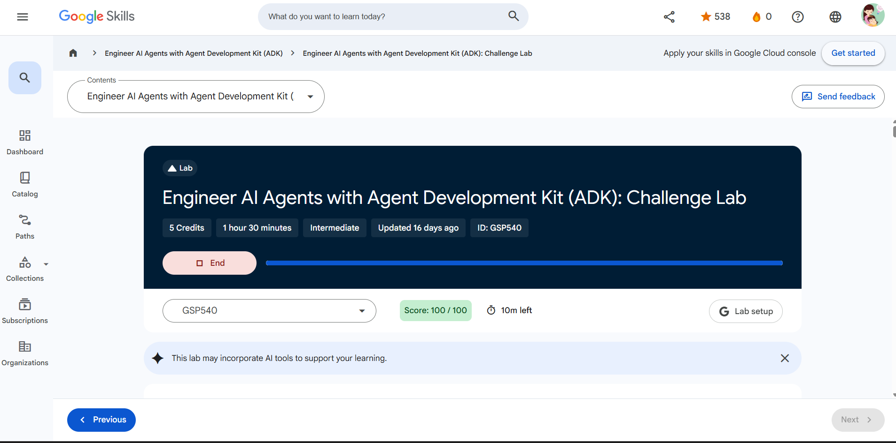
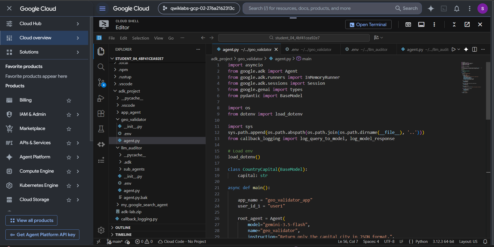
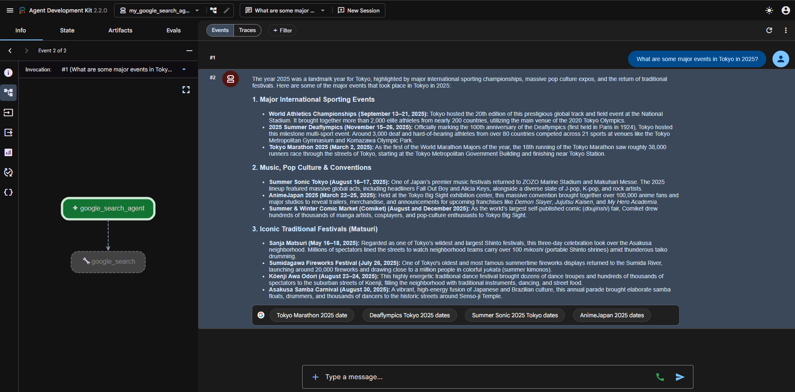
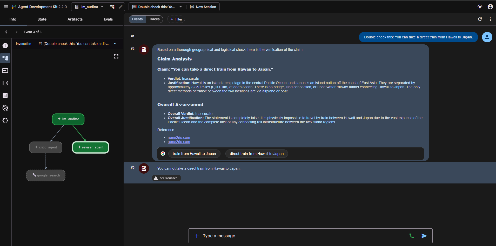
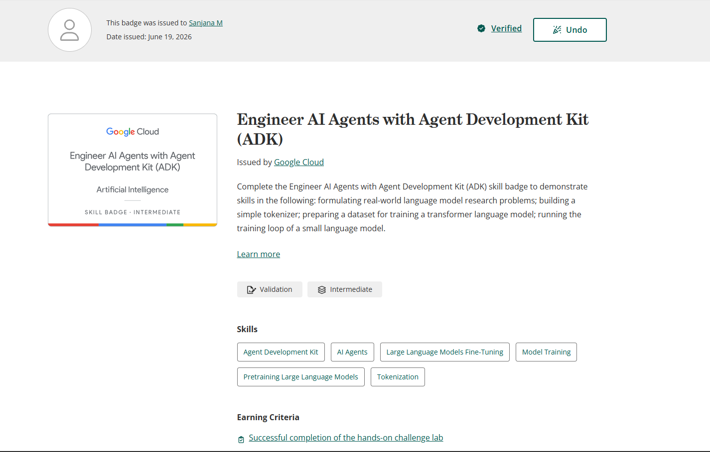

# Google ADK Challenge Lab

## Overview

This repository contains my hands-on work and learning outcomes from the **Google Cloud Engineer AI Agents with Agent Development Kit (ADK) Challenge Lab**.

During this lab, I built and tested multiple AI agents using Google's Agent Development Kit (ADK), integrated Gemini models, configured Agent Platform environments, implemented structured outputs using Pydantic, and worked with multi-agent workflows.

---

## Skills Learned

### Task 1 - Build an AI Agent

- Created an AI agent using Google ADK.
- Configured Agent Platform environment variables.
- Integrated Gemini 3.5 Flash model.
- Executed agents using ADK Runner.
- Managed agent sessions and user interactions.

### Task 2 - Google Search Agent

- Built a search-enabled AI agent.
- Connected Google Search tools with ADK.
- Retrieved and summarized web information.
- Tested real-time information retrieval workflows.

### Task 3 - Geo Validator Agent

- Implemented structured outputs using Pydantic.
- Created JSON schema validation.
- Enforced strict response formats.
- Configured model constraints and validation rules.
- Used callbacks for logging model requests and responses.

### Task 4 - Agent Platform Configuration

- Configured Agent Platform using environment variables.
- Connected ADK with Google Cloud services.
- Used enterprise Gemini deployment settings.
- Managed project and location configurations.

### Task 5 - Multi-Agent Brochure Auditor

- Worked with Sequential Agents.
- Implemented Critic Agent workflow.
- Restored Reviser Agent functionality.
- Built a complete multi-agent pipeline.
- Verified factual claims using agent collaboration.
- Tested agent-to-agent workflow execution.

---

## Technologies Used

- Python
- Google Agent Development Kit (ADK)
- Gemini 3.5 Flash
- Google Cloud
- Agent Platform
- Pydantic
- AsyncIO
- Cloud Logging

---

## Key Concepts Practiced

- AI Agents
- Multi-Agent Systems
- Sequential Agents
- Structured Outputs
- JSON Schema Validation
- Agent Sessions
- Prompt Engineering
- Tool Calling
- Workflow Orchestration
- Fact Verification
- Agent Collaboration
- Cloud-Based AI Deployment

---

## Screenshots

### Challenge Lab Home Page

---

### Geo Validator Agent

---

### Google Search Agent

---

### Multi-Agent Brochure Auditor

---

### Skill Badge

---

## Achievement

- Successfully completed the **Google Cloud Engineer AI Agents with Agent Development Kit (ADK) Challenge Lab**
- Achieved **100/100 Score**
- Earned the **Google Cloud Skill Badge**
- Gained hands-on experience with AI agent development and multi-agent systems.

---

## Author

**Sanjana M**

BE - Artificial Intelligence and Machine Learning

Aspiring SOC Analyst | Cybersecurity & AI Enthusiast

GitHub: https://github.com/Sanjana-crypto
